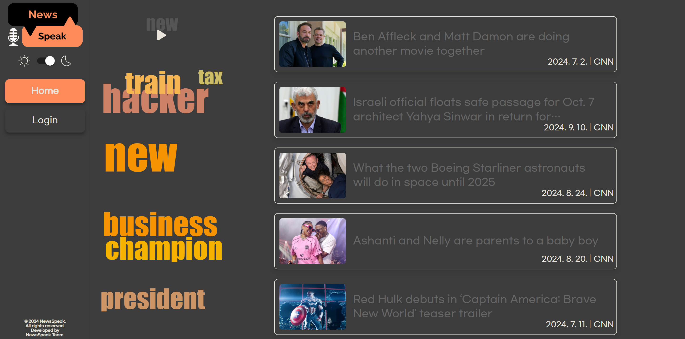
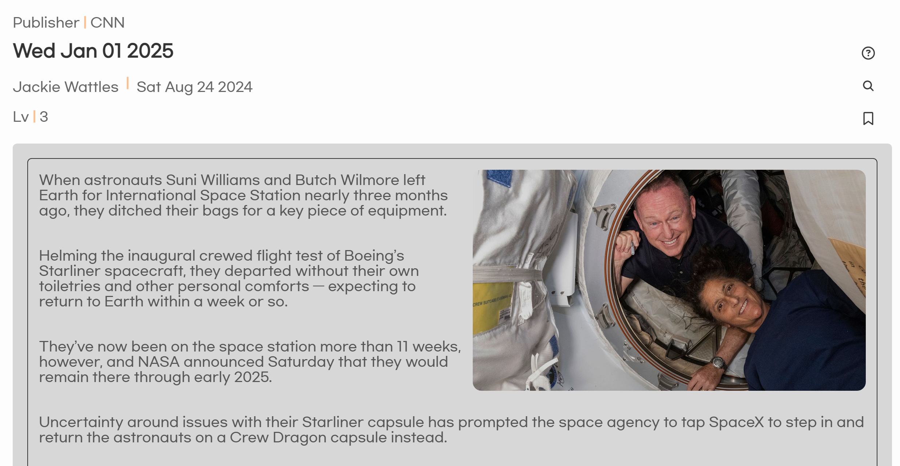
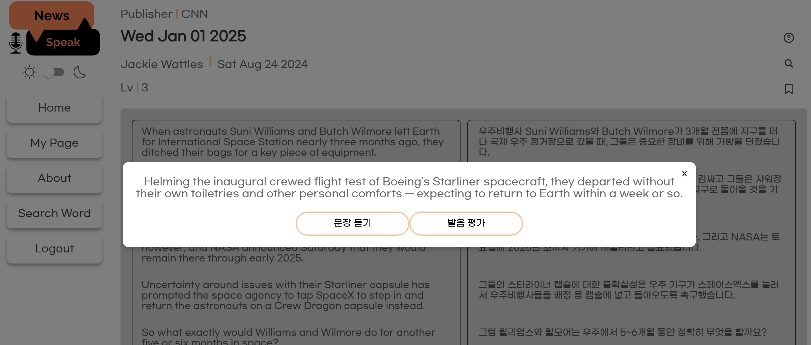
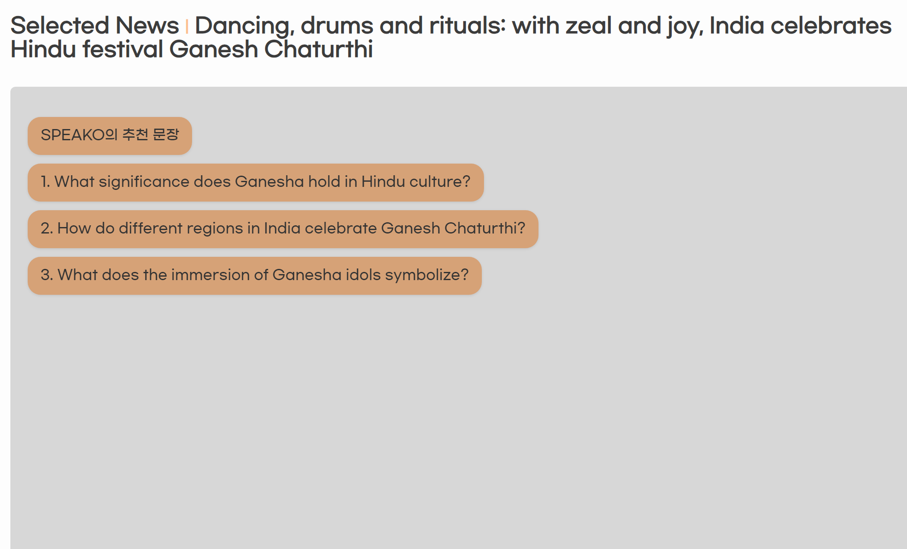

# NewSpeak

## 영어 뉴스로 학습하는 비즈니스 영어

---

### newSpeak v1.0

---

> **삼성청년 소프트웨어 아카데미 E103조** > **개발기간: 2024.08.19 ~ 2024.10.11**

### Link

---

> **https://j11e103.p.ssafy.io**

---

**Requirements**

For building and running the application you need:

- Node.js 20.15.0
- React 18.3.1
- Java 18
- Spring Boot 3.3.1
- Mysql 8.0.38

---

### Stacks 🐈

---

**Environment**

 

**Config**
 

**Development**

- **FrontEnd**
    

- **Backend**
       
- **DataBase**
   
- **Infra**
       

**projectMange**

 

---

### System architecture

- MySQL 과 Monstache 를 사용하여 실시간 MongoDB 로 데이터 베이스를 구성.
  - MySQL은 RDB로 사용하며 비교적 작은 데이터와 조인을 해결.
  - MongoDB 와 ElasticSearch는 자연어 분석 검색 쿼리를 실행하기 위해 설계.

---

### User Interface

- 메인페이지

- 기사 상세 페이지

- 번역과 발음 평가

- 회화 페이지

  - 듣기와 추천

  

  - 말하기

  

- 회화 평가 보고서

---

### Main Feature

**FrontEnd**

**BackEnd**

> - OpenAi 챗봇 기능 구현
> - TTS를 활용한 회화 기능 구현
> - 회화 보고서 완성을 위한 OpenAi Assistant 활용
> - Google Cloud Storage를 활용한 저장소 확보
> - Oauth 2.0 을 활용한 JWT 인증

---

### Members

# 👨‍👨‍👧 팀원 소개

|           | 이창호                                           | 최지우                              | 정훈                              | 김동환                                     | 박영훈                             | 이권민                                      |
| --------- | ------------------------------------------------ | ----------------------------------- | --------------------------------- | ------------------------------------------ | ---------------------------------- | ------------------------------------------- |
| 프로필    |                  |          |        |                 |         |                  |
| 역할      | 팀장  Data, Infra                             | Frontend                            | Frontend                          | Backend                                    | Backend                            | Infra                                       |
| 세부 역할 | 데이터 수집 및 관리 DB설계 Project Mangage | UI/UX Design STT              | UI/UX Design STT            | OpenAI  CRUD   ElasticSearch         | Oauth2.0   Nginx   JWT       | Jenckins pipeline   docker  Monstache |
| 깃헙 주소 | [Github](https://github.com/changho)             | [Github](https://github.com/ji-ooo) | [Github](https://github.com/hoon) | [Github](https://github.com/offensivesoup) | [Github](https://github.com/hoon2) | [Github](https://github.com/Gongman41)      |
