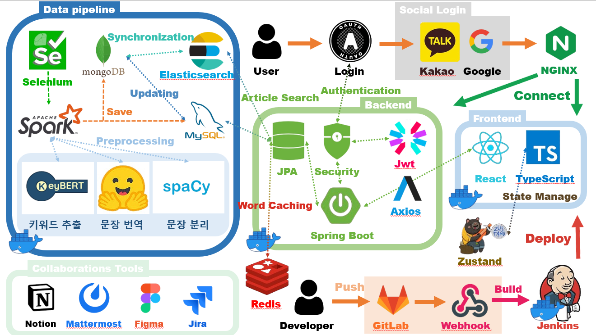
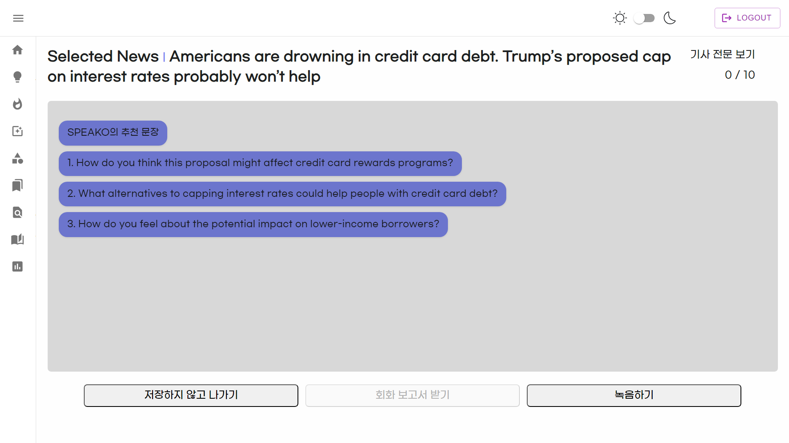

# NewSpeak

## 영어 뉴스로 학습하는 비즈니스 영어 📘

---

### Project Introduction

**NewSpeak**는 비즈니스 영어 학습자를 위한 영어 학습 플랫폼으로, 실시간 뉴스 콘텐츠를 통해 실용적인 영어를 학습하도록 도와줍니다.

---

### Team Information 👥

> **삼성청년 소프트웨어 아카데미 E103조**  
> **개발기간: 2024.08.19 ~ 2024.10.11**

---

### Project Link 🔗

[**NewSpeak 공식 사이트**](https://j11e103.p.ssafy.io)

---

### Requirements 🛠️

For building and running the application, you need:

- Node.js 20.15.0
- React 18.3.1
- Java 18
- Spring Boot 3.3.1
- MySQL 8.0.38

---

### Stacks 🐈

#### **Environment**

 

#### **Config**

 

#### **Development**

### **FrontEnd**

  

#### **Backend**

     

#### **DataBase**

 

#### **Infra**

     

---

### System architecture

##### 데이터베이스 설계

MySQL & Monstache를 사용하여 MongoDB와 Elasticsearch를 실시간으로 동기화하여 데이터베이스를 구성합니다.
MySQL: 관계형 데이터베이스(RDB)로서, 상대적으로 작은 데이터 및 복잡한 조인 연산을 처리합니다.
MongoDB & Elasticsearch: 비정형 데이터를 저장하고, 자연어 분석 및 검색 쿼리를 효과적으로 처리하기 위해 설계되었습니다.

##### 데이터 파이프라인

Selenium을 사용하여 웹 스크래핑으로 뉴스 기사를 수집하고, Apache Spark를 통해 수집된 데이터를 전처리하여 MongoDB와 MySQL에 저장합니다.
Monstache를 사용하여 MySQL과 MongoDB 간의 실시간 데이터 동기화를 수행합니다.
Elasticsearch와 MongoDB를 연결하여 자연어 검색 쿼리를 실행할 수 있도록 지원합니다.
KeyBERT: 키워드 추출을 위한 도구.
Hugging Face: 문장 번역 및 자연어 처리.
spaCy: 텍스트 데이터 전처리 및 문장 분리.

##### 인증 및 보안

OAuth를 활용한 사용자 로그인 및 인증.
Kakao와 Google 소셜 로그인을 지원하여 다양한 방식으로 로그인할 수 있습니다.
Spring Security와 JWT를 사용한 API 보안 및 권한 관리.

##### 프론트엔드

React & TypeScript: 사용자 인터페이스 및 클라이언트 로직을 구현.
State Management: Zustand 라이브러리를 사용하여 상태 관리.
Axios를 사용하여 백엔드와 통신.
NGINX: 프론트엔드 정적 파일을 서빙하고, 백엔드 API와 연결하여 통신을 관리.

##### 배포 및 관리

Jenkins와 GitLab을 통해 CI/CD 파이프라인을 구축하여 코드의 자동 빌드 및 배포를 수행합니다.
Redis를 사용하여 빠른 데이터 캐싱을 처리하고, 애플리케이션의 성능을 향상시킵니다.
Docker 컨테이너를 사용하여 각 서비스의 배포 및 운영 환경을 통합적으로 관리합니다.

##### 협업 도구

Notion, Mattermost, Figma, Jira를 통해 개발 팀의 문서화, 커뮤니케이션, 디자인 협업, 프로젝트 관리를 지원합니다.

### User Interface

##### 메인페이지

##### 기사 상세 페이지

##### 번역과 발음 평가

##### 회화 페이지

###### 듣기와 추천

###### 말하기

###### 회화 평가 보고서

---

### Main Feature

##### **FrontEnd**

- 단어 선택 및 팝업 표시 : 사용자가 드래그하여 단어를 선택하면 팝업 창이 나타나 단어를 추가하거나 학습할 수 있습니다.
- 단어장 관리 : 사용자가 저장한 단어 목록을 확인하고, 단어의 뜻, 예문, 발음을 학습할 수 있습니다.
- 카테고리별 기사 탐색 : 상단의 카테고리 버튼을 통해 각 카테고리의 기사 목록을 탐색하고, 선택한 카테고리의 기사만 조회할 수 있습니다.
- 연관 기사 표시: 특정 단어를 클릭하면 해당 단어와 관련된 뉴스 기사 목록이 표시됩니다.
- 발음 평가 모달 : 선택한 단어나 문장을 발음하여 정확도를 평가하고, 시각적으로 결과를 확인할 수 있습니다.
- 녹음 및 분석: 마이크를 통해 음성을 녹음하여 서버로 전송하고 발음 정확도를 분석합니다.
- 키워드 검색 : 사용자가 키워드를 입력하여 관련 기사를 검색할 수 있으며, 검색어 입력 시 애니메이션 효과로 UI가 변경됩니다.
- 검색 결과 표시: 검색 결과는 키워드와 일치하는 기사들을 나열하여 보여줍니다.

##### **BackEnd**

- OpenAi 챗봇 기능 구현
- TTS를 활용한 회화 기능 구현
- 회화 보고서 완성을 위한 OpenAi Assistant 활용
- Google Cloud Storage를 활용한 저장소 확보
- Oauth 2.0 을 활용한 JWT 인증

---

### Members 👨‍👨‍👧

|           | 이창호                                                 | 최지우                                                 | 정훈                                                   | 김동환                                                 | 박영훈                                                 | 이권민                                                 |
| --------- | ------------------------------------------------------ | ------------------------------------------------------ | ------------------------------------------------------ | ------------------------------------------------------ | ------------------------------------------------------ | ------------------------------------------------------ |
| 프로필    |  |  |  |  |  |  |
| 역할      | 팀장  Data, Infra                                   | Frontend                                               | Frontend                                               | Backend                                                | Backend                                                | Infra                                                  |
| 세부 역할 | 데이터 수집 및 관리 DB설계 Project Manage        | UI/UX Design STT                                 | UI/UX Design STT                                 | OpenAI  CRUD   ElasticSearch                     | Oauth2.0   Nginx   JWT                           | Jenckins pipeline   docker  Monstache            |
| 깃헙 주소 | [Github](https://github.com/changho)                   | [Github](https://github.com/ji-ooo)                    | [Github](https://github.com/bananahun)                 | [Github](https://github.com/offensivesoup)             | [Github](https://github.com/hoon2)                     | [Github](https://github.com/Gongman41)                 |

